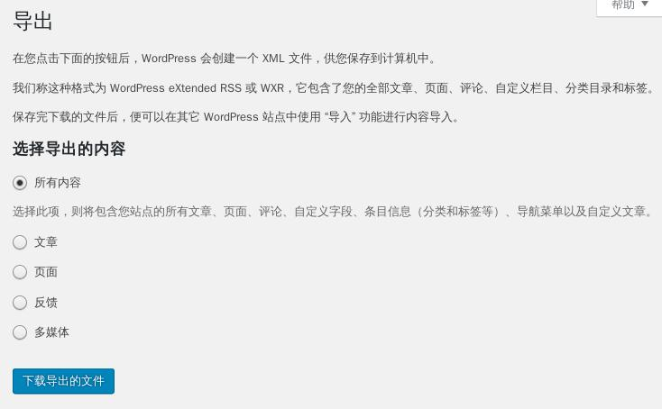

# 从Wordpress迁移到Hexo


[上一篇文章](/how-to-blog-with-hexo-over-github/)里我介绍了怎样用Hexo在Github上搭建静态博客。

有很多人之前可能都在其它地方用Wordpress写过博客，而且里面可能已经有不少文章了。那要如何才能把文章转到这个新的博客上呢？

这篇文章就是介绍如何把博客从Wordpress迁移到Hexo.


## 从Wordpress中导出

首先，我们要把现有的文章从Wordpress中导出。

1. 登入Wordpress后台。

2. 左侧菜单里面选*工具*->*导出*。


3. 进入导出页面后选择所有内容。



4.下载导出的文件。

## 导入到Hexo中

Hexo提供了一个插件可以把Wordpress导出的XML文件导入。

### 安装插件

Hexo的插件也是通过npm来安装的。

```bash
$ npm install hexo-migrator-wordpress --save
```

### 执行导入插件

插件安装好后，执行以下命令进行导入。

```bash
$ hexo migrate wordpress <.xml>   # <.xml>为Wordpress导出的文件名
```

> 此插件进行数据转换时并不完美，在处理Wordpress的分类时有可能会出问题。建议导入完成后手工检查source\_ports中生成的所有markdown文件。

## 重新生成、发布

如[上一篇文章](/how-to-blog-with-hexo-over-github/)所讲，做任何改动后都需要重新生成。导入后执行以下命令重新生成、发布。

```bash
$ hexo g -d
```

至此文章全部迁移到Hexo。

